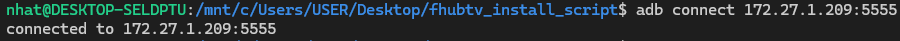
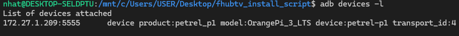
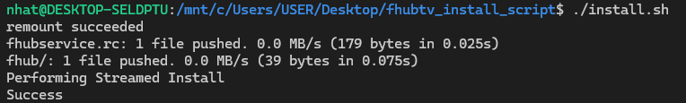

# REQUIREMENT
- Platform: aosp run on orange pi 3 LTS
- Download [Phoenixcard](https://drive.google.com/drive/folders/1ui3vkKAu7Nl-iJuFJqJG2kJVB4CAzN8N)
- Download [Android Image](https://drive.google.com/drive/folders/1GPYZedwITu3139VuEBgnMDsKReyw3ZCs)  
# SETUP
## 1.Burn android image to OrangePi
  

- Open PhoenixCard application on Windows
- Chosse android image downloaded before
- Choose "Start up" mode
- Click "Burn"
## 2.Power up OrangePi
Open folder in linux (or VM, wsl)
Find orange pi ip address  
Connect to orange pi using adb (adb is avalabled on ubuntu)
```sh
adb connect 172.27.1.209:5555
```
  

List connected devices
```sh
adb devices -l
```

## 3.Install apk
Move *.apk file to this folder, like this
```
aosp_app_installer
├── fhub
│   └── fhub.sh
├── .gitignore
├── app-release.apk
├── fhubservice.rc
├── install.sh
└── README.md
```
Run script to install
```sh
./install.sh
```
  

Done! Waiting orangepi to reboot  
To reinstall app, connect and run install.sh again
## 4.Clone drive
If you have aosp and apk install on an sd card, you could clone that disk to another disk using [Balena Etcher](https://etcher.balena.io/) and don't need to follow three steps above
# Cheat Sheet
Connect over ip address
```sh
adb connect <ip address>:5555
```
Shutdown
```sh
adb shell reboot -p
```
Reboot
```sh
adb shell reboot
```
Install package using apk
```sh
adb install app-release.apk
```
Uninstall package
```sh
adb uninstall com.example.exoplayer
```
**Tips**: To find package, type "adb uninstall" and push "tab" twice on keyboard