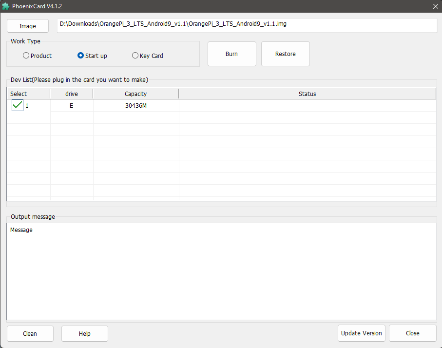
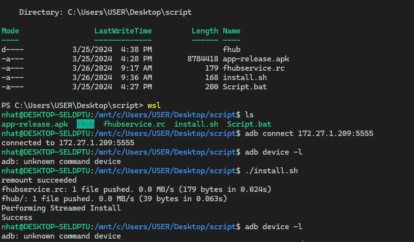

# REQUIREMENT
- Platform: aosp run on orange pi 3 LTS
- Download [Phoenixcard](https://drive.google.com/drive/folders/1ui3vkKAu7Nl-iJuFJqJG2kJVB4CAzN8N)
- Download [Android Image](https://drive.google.com/drive/folders/1GPYZedwITu3139VuEBgnMDsKReyw3ZCs)
# SETUP
## Burn android image to OrangePi

- Choose "Start up" mode
- Click "Burn"
## Power up OrangePi
open folder in linux(or VM, wsl)
Connect to orange pi using adb (adb is avalabled on ubuntu)
```sh
adb connect 172.27.1.209:5555
```
List connected devices
```sh
adb devices -l
```
Install
```sh
./install.sh
```
Done! Waiting orangepi to reboot

## Install apk

## Terminal Screenshot
